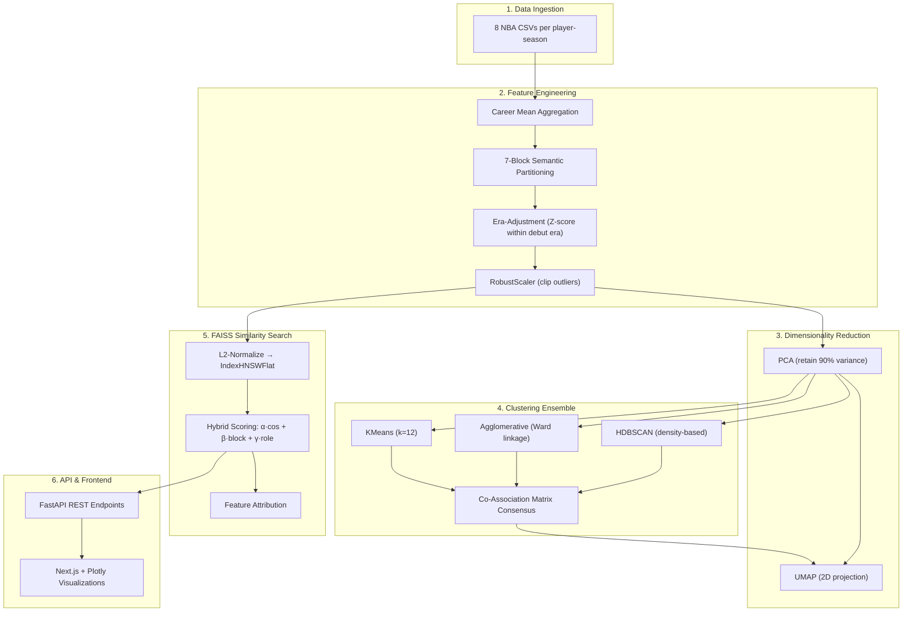
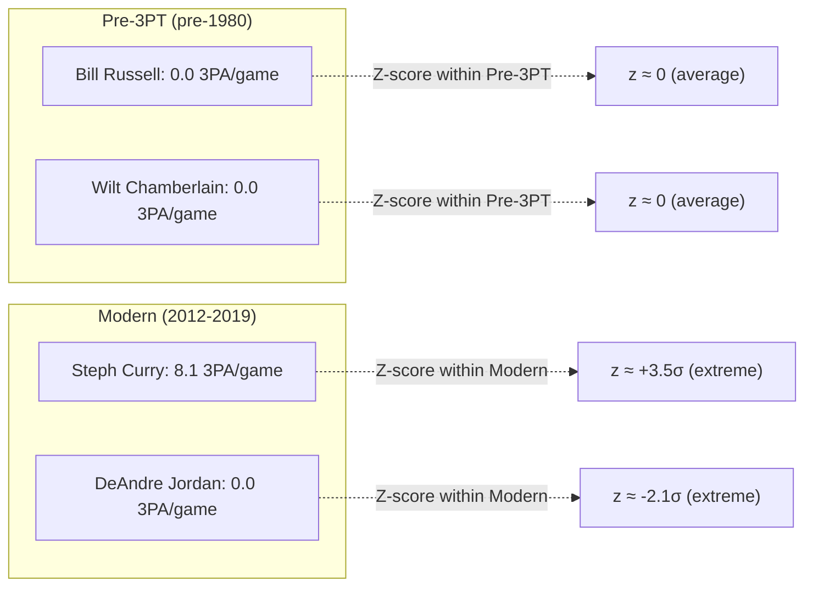
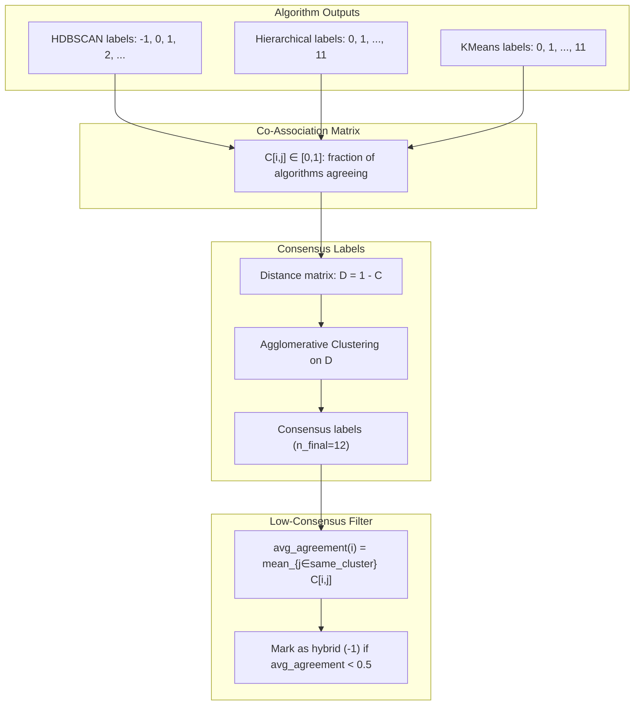
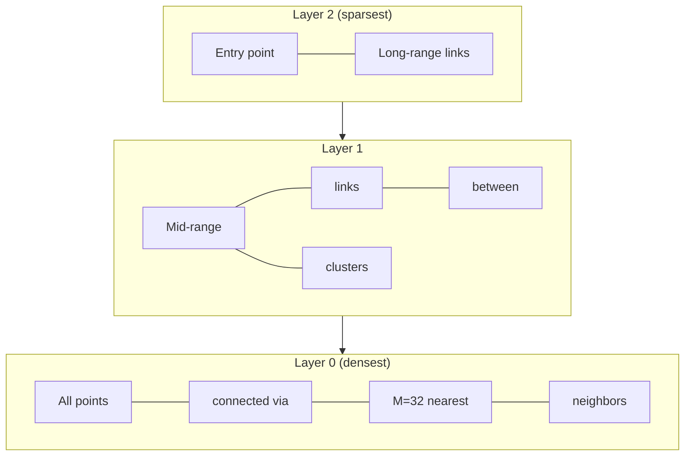
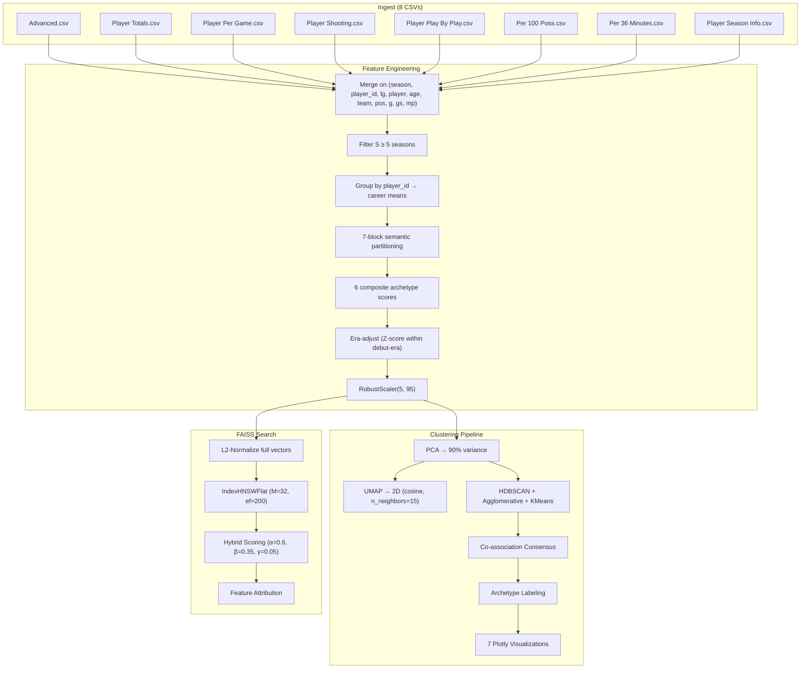
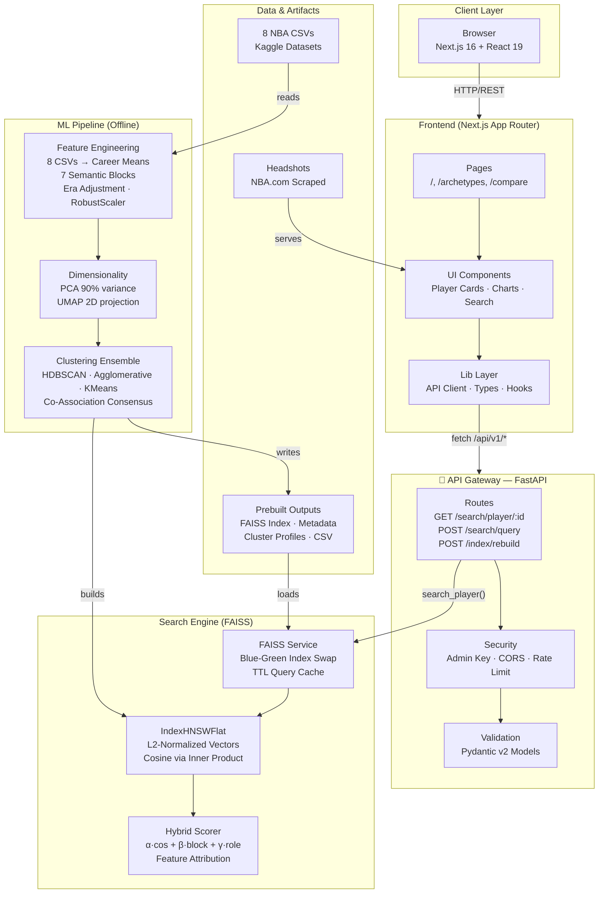
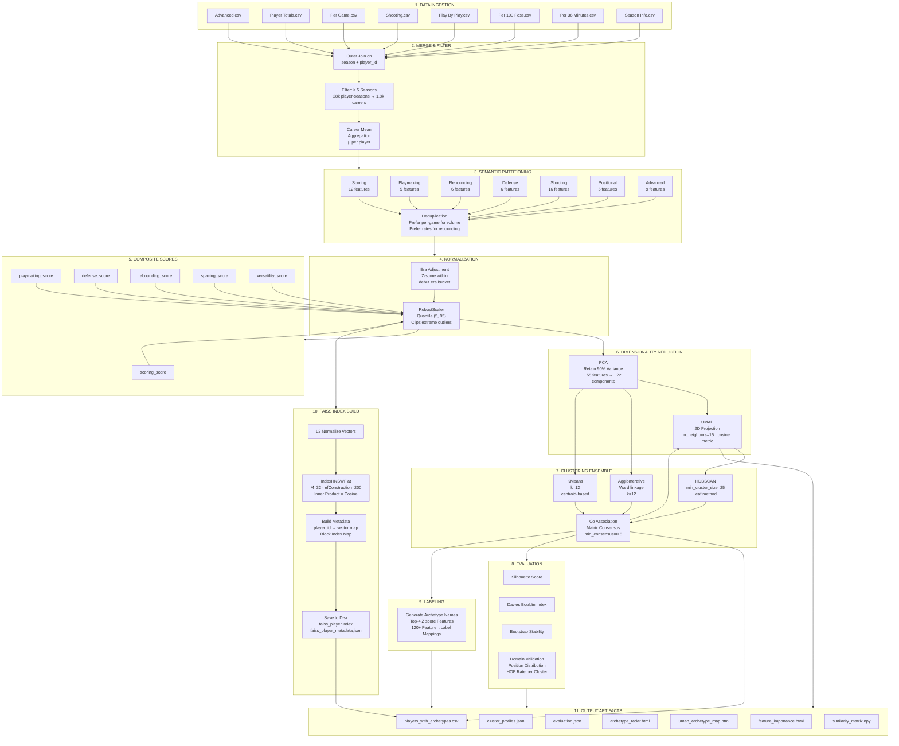
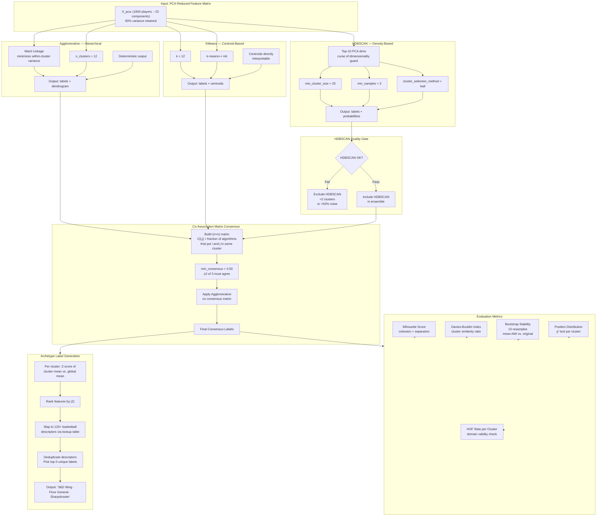
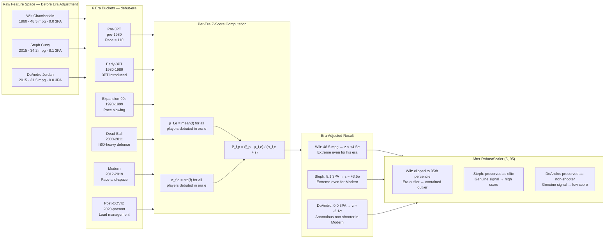

# Statsketball

## General Overview
Statsketball is an application that takes NBA players, and maps them to certain archetypes to determine which players are the most similar, and attempt to determine this beyond box scores and regular stats. 

I used 8 different player datasets from kaggle. Those datasets are: Advanced stats, Player Totals, Per Game, Shooting, Play By Play, Per 100 Posessions, Per 36 Minutes, and Player Season Info. 


I then used Pandas to consolidate, and manipulate the datasets. 


I used FAISS (Facebook AI Similarity Search), to allow 


I also created interactive data visualization using Plotly, where users can view a similarity graph of a player, and view his nearest neighbours. Users can also click on the player to create more nodes and edges. 


### System Overview




## 1: Feature Engineering

### 1.1: Career Aggregation. 
For each player $p$, we have season by season statistics over $S_{p}$ seasons. Features that encompass the player's career as a whole are calculated through this mean:

```math
\bar{f}_{p}
 = 
\frac{1}{S_{p}} \sum_{s=1}^{S_{p}} f_{p,s}
```

where $f_{p,s}$ is the feature value for player $p$ in season $s$.  Only players with 𝑆𝑝≥5 seasons are retained. This filters out one and done players, and players who don't really have enough data to quantify their playstyles. 
The aggregation collapses ~28,000 player-seasons into ~1,800 career-level vectors.


### 1.2: Seven Semantic Feature Blocks

The feature space is divided  into seven different blocks, that each measure a distinct dimension of playing style:

Block	Cardinality	Representative Features
Scoring	12	`pts_per_game`, `usg_percent`, `ts_percent`, `fg_percent`
Playmaking	5	`ast_per_game`, `ast_percent`, `tov_percent`
Rebounding	6	`orb_percent`, `drb_percent`, `trb_percent`
Defense	6	`stl_percent`, `blk_percent`, dbpm, dws
Shooting	16	`avg_dist_fga`, `x3p_ar`, shot zone percentages
Positional	5	`pg_percent`, `sg_percent`, `sf_percent`, `pf_percent`, `c_percent`
Advanced	9	per, bpm, obpm, vorp, ws, `ws_48`

#### Deduplication rule:

When multiple variants of the same concept exist (e.g., `pts_per_game`, `pts_per_100_poss`, `pts_per_36_min`), only the canonical form is kept (`pts_per_game` for scoring volume, `orb_percent` (rate) for rebounding (since rates are era-invariant while raw counts are pace-dependent).)


### 1.3: Composite Archetype Scores

From the seven blocks, six composite Z-score indices are computed using StandardScaler: 

```math
z_f = \frac{f - \mu_f}{\sigma_f}
```

For each of the six archetype dimensions, the composite is the mean of its constituent Z-scored features:

```math
\begin{aligned}
\text{Scoring}_p &= \frac{1}{|\mathcal{S}|} \sum_{f \in \mathcal{S}} z_{f,p} \quad \text{where } \mathcal{S} = \{\text{pts, usg\%, per, fg\_per\_game, fga\_per\_game}\} \\
\text{Playmaking}_p &= \frac{1}{|\mathcal{P}|} \sum_{f \in \mathcal{P}} z_{f,p} \quad \text{where } \mathcal{P} = \{\text{ast\_per\_game, ast\%, tov\%, pts\_generated\_by\_asts}\} \\
\text{Defense}_p &= \frac{1}{|\mathcal{D}|} \sum_{f \in \mathcal{D}} z_{f,p} \quad \text{where } \mathcal{D} = \{\text{stl\%, blk\%, dbpm, dws}\} \\
\text{Rebounding}_p &= \frac{1}{|\mathcal{R}|} \sum_{f \in \mathcal{R}} z_{f,p} \quad \text{where } \mathcal{R} = \{\text{orb\%, drb\%, trb\%, orb\_per\_game, drb\_per\_game, trb\_per\_game}\} \\
\text{Spacing}_p &= \frac{1}{|\mathcal{SP}|} \sum_{f \in \mathcal{SP}} z_{f,p} \quad \text{where } \mathcal{SP} = \{\text{x3p\_ar, avg\_dist\_fga, 3p\%}\} \\
\text{Versatility}_p &= \frac{1}{|\mathcal{V}|} \sum_{f \in \mathcal{V}} z_{f,p} \quad \text{where } \mathcal{V} = \{\text{pg\%, sg\%, sf\%, pf\%, c\%}\}
\end{aligned}
```


where `Versatility_p` captures positional diversity, or  how evenly a player's minutes are distributed across the 5 positions (pg, sg, sf, pf, c).  The positional entropy itself is implicitly captured by the Z-score mean across
{`pg_percent`, `sg_percent`, `sf_percent`, `pf_percent`, `c_percent`}. 


### 1.4: Era Adjustment

A 1980s power forward attempting 2 three-pointers per game was a spacing revolutionary.
By 2025 standards, that's a non-shooter. 
To prevent raw feature space from encoding era instead of style, every feature is Z-scored within the player's debut era:




Formally, for each feature $f$, and each debut era $e$:

```math
\mu_{f,e} = \frac{1}{|P_e|} \sum_{p \in P_e} \bar{f}_p, \quad \sigma_{f,e} = \sqrt{\frac{1}{|P_e|} \sum_{p \in P_e} (\bar{f}_p - \mu_{f,e})^2}
```

```math
\tilde{f}_p = \frac{\bar{f}_p - \mu_{f, \text{era}(p)}}{\sigma_{f, \text{era}(p)} + \epsilon}
```


where $P_e$ is the set of players who debuted in era $e$, and $\epsilon = 10^{-8}$ guards against zero-variance features. Debut era is used (not per-season) so a player's entire career is normalized against the era they entered the league in. 

This prevents a player like lebron for example having his 2003 stats compared to 2026 standards. 


The six era buckets are:

•Pre-3PT (pre-1980): No three-point line; pace ≈ 110+ possessions/48

•Early-3PT (1980–1989): Three-point line introduced but rarely used

•Expansion-90s (1990–1999): League expansion; pace slowing

•Dead-Ball (2000–2011): Lowest pace era; defensive dominance; ISO-heavy

•Modern (2012–2019): Pace-and-space revolution; 3PT explosion

•Post-COVID (2020–present): Super-max contracts; load management era


### 1.5: RobustScaler

Even after adjusting for the era, extreme outliers are still there. For example Wilt Chamberlain's minutes and rebounds are still $>4\sigma$ even with era adjustment. RobustScaler, with a quantile range of (5.0, 95.0) clips these:

```math
\tilde{f}_p^{\text{scaled}} = \frac{\tilde{f}_p - Q_{0.5}(\tilde{f})}{Q_{0.95}(\tilde{f}) - Q_{0.05}(\tilde{f})}
```


This is preferred over StandardScaler (which uses mean ± std) because the median and interquartile range are robust to the extreme outliers that characterize historical basketball statistics.


## 2: Dimensionality Reduction

### 2.1: PCA (Denoising)

PCA (Principal Component Analysis) decomposes the $N \times D$ feature matrix $\mathbf{X}$ (after RobustScaler) into:

```math
\mathbf{X} = \mathbf{T} \mathbf{P}^T + \mathbf{E}
```

Where $\mathbf{T}$ is the $N \times k$ score matrix, $\mathbf{P}$ is the $D \times k$ loading matrix, and $\mathbf{E}$ is the residual. The number of components $k$ is chosen to retain 90% of total variance:

```math
k = \min\left\lbrace j : \frac{\sum_{i=1}^{j} \lambda_i}{\sum_{i=1}^{d} \lambda_i} \geq 0.90\right\rbrace
```

where $\lambda_i$ are eigenvalues of the matrix $\frac{1}{n-1}\mathbf{X}^T\mathbf{X}$, sorted in descending order. 


Our empirical result, with ~65 era-adjusted features, is that the PCA retains about 90% variance at $k \approx 35-55$ components for players.
PCA has two distinct purposes: 

1. Denoising: Low variance componenents have alot of noise. Things such as measurement errors, or imputation artifacts are discarded. 

2. De correlation: The transformed space has orthogonal axes, and this improves the distance metric behaviour for both clustering, and searching for similarity. 


### 2.2: UMAP Visualization

Uniform Manifold Approximation and Projection, or UMAP for short, creates a two dimensional, PCA reduced space, that allows for interactive visualization. 
UMAP creates a weighted k-nearest neighbor graph with a fuzzy simplicial set representation:

```math
\mu(x_i, x_j) = \exp\left(-\frac{d(x_i, x_j) - \rho_i}{\sigma_i}\right)
```

where $\rho_i$ is the distance to $x_i$'s nearest neighbour, and $\sigma_i$ is chosen so that:

```math
\sum_{j=1}^{k} \exp\left(-\frac{d(x_i, x_{i_j}) - \rho_i}{\sigma_i}\right) = \log_2(k)
```

This low dimensional embedding $\{y_i\}$ is optimized using cross-entropy between the high-dimensional fuzzy set membership $\mu$ and the low-dimensional membership $\nu$:

```math
\mathcal{L}_{\text{UMAP}} = \sum_{i \neq j} \left[\mu_{ij} \log\frac{\mu_{ij}}{\nu_{ij}} + (1 - \mu_{ij}) \log\frac{1 - \mu_{ij}}{1 - \nu_{ij}}\right]
```

where $\nu_{ij} = \left(1 + a\|y_i - y_j\|^{2b}\right)^{-1}$ is a Student-t kernel approximating the indicator $\mathbb{1}_{\|y_i - y_j\| \leq \text{min\_dist}}$.

Key parameters: `n_neighbors=15` (balances local/global structure), `min_dist=0.1` (avoids point collapse), `metric="cosine"` (emphasizes directional similarity — style direction over magnitude). Cosine distance on PCA space is:

```math
d_{\cos}(\mathbf{u}, \mathbf{v}) = 1 - \frac{\mathbf{u} \cdot \mathbf{v}}{\|\mathbf{u}\| \|\mathbf{v}\|}
```


## 3: Clustering 
The clustering pipeline takes three parallel algorithms, and then combines their outputs with a co association matrix consensus.


### 3.1: HDBSCAN 

HDBSCAN creates a mutual reachability graph:

```math
d_{\text{mreach},k}(\mathbf{x}_p, \mathbf{x}_q) = \max\{\text{core}_k(\mathbf{x}_p), \text{core}_k(\mathbf{x}_q), d(\mathbf{x}_p, \mathbf{x}_q)\}
```

where $\text{core}_k(\mathbf{x})$ is the distance to the $k$-th nearest neighbour (here $k = \text{min\_samples} = 3$).
A minimum spanning tree is built using this graph, and a cluster hierarchy is created by removing edges by weight, in descending order.
Clusters are then extracted using the leaf selection method, with $\text{min\_cluster\_size} = 25$ (~1.4% of all players):

```math
\mathcal{C}_{\text{HDBSCAN}} = \{\mathbf{x}_i : \lambda_{\text{birth}}(\mathbf{x}_i) - \lambda_{\text{death}}(\mathbf{x}_i) \geq \text{threshold}\}
```

where $\lambda = 1/d$ is the density level. Players in a low density region, are labeled as noise, or a -1. This represents hybrid, or transitional playing styles that don't exactly fit into one type of player. 

HDBSCAN is included only if it finds ≥ 2 clusters, with <50% noise. 
If the data is too homoeneous for density based separation, then HDBSCAN is not included. 


### 3.2: Agglomerative Hierarchical (Ward linkage)

Ward's method minimizes the within-cluster sum of squared errors during each merge:

```math
\Delta(A, B) = \frac{|A| \cdot |B|}{|A| + |B|} \|\bar{\mathbf{x}}_A - \bar{\mathbf{x}}_B\|^2
```

where $\bar{\mathbf{x}}_A$, $\bar{\mathbf{x}}_B$ are centroids of clusters $A$ and $B$. 
 Ward linkage on Euclidean PCA space with k=12 produces a dendrogram that captures nested style relationships, such as how "shot creators" might split itself into "volume scorers" or efficient scorers, with a finer granularity. 


 ### 3.3: KMeans (Interpretable Baseline)

 KMeans minimizes the within-cluster sum of squares:

```math
\arg\min_{\mathcal{C}} \sum_{i=1}^{k} \sum_{\mathbf{x} \in C_i} \|\mathbf{x} - \boldsymbol{\mu}_i\|^2
```

where $\boldsymbol{\mu}_i = \frac{1}{|C_i|}\sum_{\mathbf{x} \in C_i} \mathbf{x}$ is the centroid of cluster $i$. 

 KMeans with $k=12$ and `n_init="auto"` gives us directly interpretable centroids, or the average player for each type. This gives us a stable baseline to use for consensus. 


 ### 3.4: Co-Association Matrix Consensus

The co-association matrix $\mathbf{C} \in [0, 1]^{n \times n}$ captures the frequency of players being assigned to the same cluster across different algorithms:

```math
C_{ij} = \frac{1}{|\mathcal{A}|} \sum_{a \in \mathcal{A}} \mathbb{1}\left[\ell_a(i) = \ell_a(j) \land \ell_a(i) \neq -1\right]
```

where $\mathcal{A}$ is the set of algorithms (HDBSCAN, Hierarchical, KMeans), and $\ell_a(i)$ is the cluster label assigned by algorithm $a$ to player $i$.   




The consensus labels are obtained by clustering the distance matrix 𝐷=1−𝐶 , with agglomerative clustering (average linkage, precomputed metric). Players whose average co-association with their own cluster is below
`min_consensus=0.5` are labeled as hybrid or transitional ($-1$). These players are outliers, that are between archetypes. 


## 4: Archetype Labeling

Each cluster is labeled by calculating the Z-score of its centroid relative to the global mean:

```math
z_{f,c} = \frac{\mu_{f,c} - \mu_{f,\text{global}}}{\sigma_{f,\text{global}} + 10^{-8}}
```

where $\mu_{f,c} = \frac{1}{|C|}\sum_{p \in C} f_p$ is the cluster mean for feature $f$. The top 4 features, calculated by the absolute value of the z-score, are matched against a curated table of basketball terms: 


(Feature, Direction)	Label
(`pts_per_game`, high)	"High-Volume Scorer"
(`ast_per_game`, high)	"Floor General"
(`blk_percent`, high)	"Rim Protector"
(`x3p_percent`, high)	"Sharpshooter"
(`stl_percent`, high)	"Ball Hawk"
(`orb_percent`, high)	"Offensive Rebounder"
(`trb_percent`, high)	"Glass Cleaner"
(`usg_percent`, high)	"High-Usage"
(`x3p_ar`, low)	"Paint-Focused"
...	(120+ (feature, direction) pairs)


Labels are concatenated with • separators, creating basketball archetype labels such as:

• "Rim Protector • Glass Cleaner • Low-Usage Big • Paint-Focused"
• "Floor General • High-Assist-Rate • Ball Hawk • Passing-Lane Disruptor"


Exemplar players are the 8 players closest to the cluster centroid, calculated by Euclidean distance:

```math
\text{exemplar}(C) = \arg\min_{\mathbf{x}_p \in C}^{(8)} \|\mathbf{x}_p - \boldsymbol{\mu}_C\|
```


## 5: Evaluation Metrics

### 5.1: Silhouette Score (Cosine)
The silhouette score determines the quality of cluster separation:

```math
s(i) = \frac{b(i) - a(i)}{\max\{a(i), b(i)\}}
```

where $a(i)$ is the mean cosine distance from point $i$ to all other points in its own cluster, and $b(i)$ is the mean cosine distance from point $i$ to all points in the nearest other cluster.

The overall silhouette is the mean across all points:

```math
S = \frac{1}{n} \sum_{i=1}^{n} s(i), \quad S \in [-1, 1]
```

Higher is better for this. Cosine similarity is used because we are clustering direction and magnitude. 


### 5.2: Davies-Bouldin Index 

The Davies-Bouldin index calculates the average similarity between each cluster and its most similar neighbor:

```math
DB = \frac{1}{k} \sum_{i=1}^{k} \max_{j \neq i} \left\lbrace \frac{\sigma_i + \sigma_j}{d(\boldsymbol{\mu}_i, \boldsymbol{\mu}_j)} \right\rbrace
```

where $\sigma_i$ is the average distance of points in cluster $i$ to its centroid $\boldsymbol{\mu}_i$. Lower is better. 


### 5.3: Temporal Stability

For player clustering, what fraction of consecutive-season players remain in the same cluster?

```math
\text{Stability} = \frac{|\{(p, s) : \ell(p_s) = \ell(p_{s+1}) \land s+1 \text{ is consecutive}\}|}{|\{(p, s) : s+1 \text{ is consecutive}\}|}
```

High stability, which is categorized as  >0.75, means that the clusters track consistent identities instead of per season noise.


### 5.4: HOF Diversity

A healthy pipeline should have Hall of Famers distributed across clusters, not concentrated into one. If all HOFers are in one cluster, the pipeline is measuring "greatness" instead of playstyle:

```math
\text{HOF Diversity} = |\{\text{unique clusters containing } \geq 1 \text{ HOF player}\}|
```


## 6: FAISS Search

### 6.1: Vector Representation

The FAISS index stores the full era-adjusted + RobustScaler-transformed vector (not PCA-reduced). This is intentional. PCA projects onto variance-maximizing axes, and amplifies usage rate and pace dominance, which is the exact failure mode of mixing "quality" with "style." The full feature space preserves feature-level independence, enabling interpretable re-ranking.


Vectors are L2-normalized before insertion:

```math
\hat{\mathbf{v}}_p = \frac{\mathbf{v}_p}{\|\mathbf{v}_p\|_2}, \quad \|\mathbf{v}_p\|_2 = \sqrt{\sum_{i=1}^{d} v_{p,i}^2}
```


### 6.2: Cosine Similarity via inner product

After L2-normalization, cosine similarity reduces to inner product:

```math
\cos(\hat{\mathbf{v}}_q, \hat{\mathbf{v}}_c) = \frac{\hat{\mathbf{v}}_q \cdot \hat{\mathbf{v}}_c}{\|\hat{\mathbf{v}}_q\| \cdot \|\hat{\mathbf{v}}_c\|} = \hat{\mathbf{v}}_q \cdot \hat{\mathbf{v}}_c = \sum_{i=1}^{d} \hat{v}_{q,i} \cdot \hat{v}_{c,i}
```


The index uses `faiss.METRIC_INNER_PRODUCT` with `IndexHNSWFlat` for approximate nearest neighbor search. HNSW (Hierarchical Navigable Small World) builds a multi-layer graph:




HNSW Parameters: $M = 32$ (bi-directional links per node), $\text{efConstruction} = 200$ (build quality), $\text{efSearch} = 64$ (query quality). 

With approximately 1800 vectors, this gives us about a 95% recall, and a sub millisecond response. 


### 6.3: Hybrid Scoring

The hybrid score for query player $q$ and candidate $c$ is:

```math
\boxed{S_{\text{hybrid}}(q, c) = \alpha \cdot \underbrace{\cos(q, c)}_{\text{full cosine}} + \beta \cdot \underbrace{\frac{\sum_{b \in \mathcal{B}} w_b \cdot \cos(q_b, c_b)}{\sum_{b \in \mathcal{B}} w_b}}_{\text{block-weighted similarity}} + \gamma \cdot \underbrace{R(q, c)}_{\text{role bonus}}}
```

where:

- $\alpha = 0.60$, $\beta = 0.35$, $\gamma = 0.05$ are the default weights.
- $\mathcal{B} = \{\text{scoring, playmaking, rebounding, defense, shooting, positional, advanced}\}$ are the seven weighted blocks.
- $w_b$ are the weight multipliers for each block. They default to $1.0$.
- $\cos(q_b, c_b)$ is the cosine calculated for each block's sub-vectors, re-normalized inside the block:

```math
\cos(q_b, c_b) = \frac{\hat{\mathbf{v}}_{q,b} \cdot \hat{\mathbf{v}}_{c,b}}{\|\hat{\mathbf{v}}_{q,b}\| \cdot \|\hat{\mathbf{v}}_{c,b}\|}
```

- $R(q, c)$ is the role bonus: $+1.0$ if query and candidate share the same position, else $0$. 


We use block weighted similarity, so that the full cosine does not get dominated by a single block, such as advanced metrics, due to a higher variance. It makes sure that each dimension is contributed equally to re-ranked score. 


### 6.4: Feature Level Attribution 

Cosine similarity is decomposed into feature-level contributions:

```math
\cos(\hat{\mathbf{v}}_q, \hat{\mathbf{v}}_c) = \sum_{i=1}^{d} \hat{v}_{q,i} \cdot \hat{v}_{c,i}
```

The fractional contributions are:

```math
\text{contrib}_i = \frac{\hat{v}_{q,i} \cdot \hat{v}_{c,i}}{\cos(\hat{\mathbf{v}}_q, \hat{\mathbf{v}}_c)}
```

The top 5 features by absolute contribution are returned as an explanation (e.g. "Player X is similar to Player Y because both have high `usg_percent`, positive `bpm`, and elite `stl_percent`."). Each block's contribution is aggregated:

```math
\text{contrib}_b = \frac{\sum_{i \in \text{block}_b} \hat{v}_{q,i} \cdot \hat{v}_{c,i}}{\cos(\hat{\mathbf{v}}_q, \hat{\mathbf{v}}_c)}
```


## 7: Similarity Matrix

The complete $N \times N$ cosine similarity matrix on PCA space is computed for the clustering pipeline:

```math
\mathbf{S} \in [-1, 1]^{n \times n}, \quad S_{ij} = \frac{\mathbf{x}_i^{\text{(pca)}} \cdot \mathbf{x}_j^{\text{(pca)}}}{\|\mathbf{x}_i^{\text{(pca)}}\| \cdot \|\mathbf{x}_j^{\text{(pca)}}\|}, \quad S_{ii} = 0
```

For datasets with $> 10{,}000$ samples, the full $O(n^2)$ computation is replaced by a KNN graph using `NearestNeighbors(metric="cosine")` with $k = 50$ neighbours:

```math
S_{ij}^{\text{sparse}} = \begin{cases} 1 - d_{\cos}(\mathbf{x}_i, \mathbf{x}_j) & \text{if } j \in \text{NN}_{50}(i) \\ 0 & \text{otherwise} \end{cases}
```

This reduces time complexity from $O(n^2)$ to $O(nk)$.


## 8: FAISS Evaluation


### 8.1: Recall@k


On labeled similar pairs (cluster co-members, manual curation), Recall@k measures the fraction of "known similar" pairs retrieved in the top $k$:

```math
\text{Recall@k} = \frac{|\{\text{queries where expected similar is in top-}k\}|}{|\{\text{queries}\}|}
```


### 8.2: Mean Reciprocal Rank (MRR)

```math
\text{MRR} = \frac{1}{|Q|} \sum_{q \in Q} \frac{1}{\text{rank}_q}
```

where $\text{rank}_q$ is the position of the first relevant result for query $q$. 


### 8.3: Regression Testing

Before promoting a new index, the top-10 results are compared to a baseline using Jaccard Similarity:

```math
J(q) = \frac{|\text{top10}_{\text{new}}(q) \cap \text{top10}_{\text{baseline}}(q)|}{|\text{top10}_{\text{new}}(q) \cup \text{top10}_{\text{baseline}}(q)|}
```

The new index is blocked if the mean Jaccard across query entities is $< 0.85$ at any point. 


## 9: Complete Pipeline Diagram and Summary


### 9.1: Mermaid Diagram of complete pipeline





### 9.2: System Architecture Diagram




### 9.3: Data Pipeline Diagram




### 9.4: Clustering Diagram





### 9.5: Era adjustment Diagram




### 9.6: Summary


There are two principles that basically sum this pipeline up: 


•1: Style is taken as a direction, instead of a magnitude: 

L2 normalizing the vectors projects each player onto the hypersphere. This is where distance is completely angular. 2 Players categorized as High Volume scorers, who have completely different shot diets, are further apart from
eachother, compared to a high-volume scorer and low volume scorer who have very similar shot diets. This makes sense, as shot diet is much more indicative of style, compared to volume, which is more indicative of quality. 


• 2: Era is not a factor in determining style: 

A great shooter from 1985, and one from 2025 should be grouped together. With era adjustment, stats that are considered "extreme for the time", are all equally factored in. For example, Reggie Miller's 3PA were considered
crazy for their time, however compared to today's standards, they are below average. Our era normalization, allows us to determine who really plays the same. 


​
 

​
 


​
 


​

​
 
 
